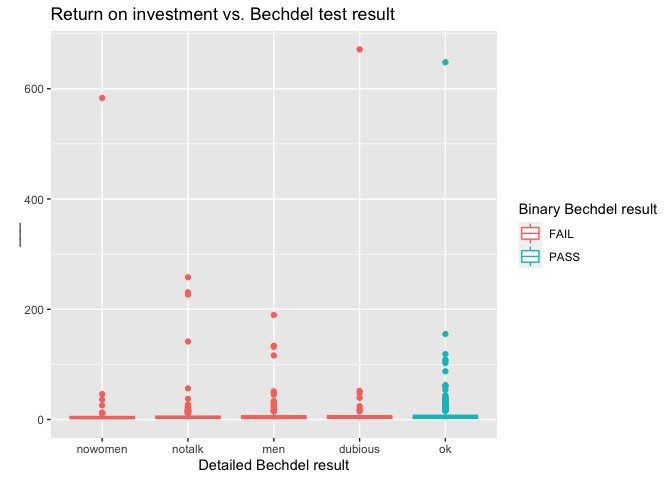
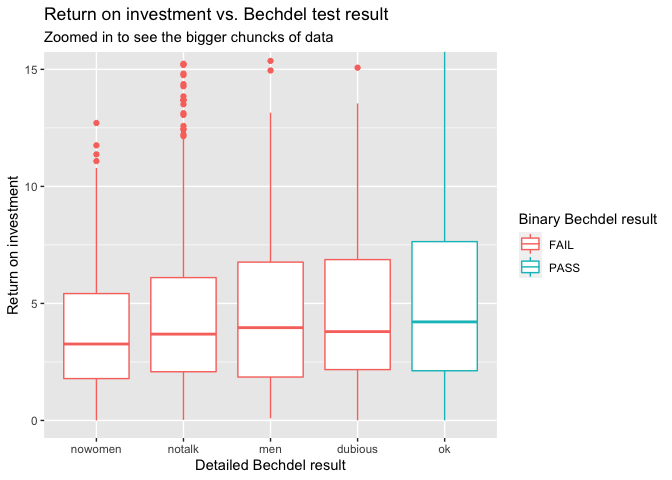

Bechdel Test
================
Created by Mine Çetinkaya-Rundel

<!--- you might change html_document to github_document if you are working with GitHub--->

In this mini analysis we work with the data used in the FiveThirtyEight
story titled [“The Dollar-And-Cents Case Against Hollywood’s Exclusion
of
Women”](https://fivethirtyeight.com/features/the-dollar-and-cents-case-against-hollywoods-exclusion-of-women/).

1.  Your task is to fill in the blanks denoted by `___` with text or
    code.  
2.  Fix any errors.  
3.  Identify specific R code function and how you looked them up.

## Data and packages

We start with loading the packages we’ll use.

``` r
library(fivethirtyeight)
library(tidyverse)
```

The dataset contains information on 1794 movies released between 1970
and 2013. However we’ll focus our analysis on movies released between
1990 and 2013.

``` r
bechdel90_13 <- bechdel %>% 
  filter(between(year, 1990, 2013))
```

> What is the `%>%` inside the code? What does it do? How did you
> determine your answer?  
> It is called a pipe operator that is meant to steamline your code
> meaning if you wanted to catorgorize, summarize, then organize as
> stated in the [“Simplify Your Code with
> %>%”](https://uc-r.github.io/pipe) artcle I found. States that it will
> make that code one who function in stead of having to create
> subsctions over and over again.

There are `1615` such movies.

The financial variables we’ll focus on are the following:

-   `budget_2013`: Budget in 2013 inflation adjusted dollars
-   `domgross_2013`: Domestic gross (US) in 2013 inflation adjusted
    dollars
-   `intgross_2013`: Total International (i.e., worldwide) gross in 2013
    inflation adjusted dollars

And we’ll also use the `binary` and `clean_test` variables for
**grouping**.

## Analysis

Let’s take a look at how median budget and gross vary by whether the
movie passed the Bechdel test, which is stored in the `binary` variable.

``` r
bechdel90_13 %>%
  group_by(binary) %>%
  summarise(med_budget = median(budget_2013),
            med_domgross = median(domgross_2013, na.rm = TRUE),
            med_intgross = median(intgross_2013, na.rm = TRUE))
```

    # A tibble: 2 × 4
      binary med_budget med_domgross med_intgross
      <chr>       <dbl>        <dbl>        <dbl>
    1 FAIL    48385984.    57318606.    104475669
    2 PASS    31070724     45330446.     80124349

``` r
?summarise()
```

> What does `summarise()` do? How did you look it up?  
> `summarise()` creates a new dataframe showcasing the summary of
> variables where you can cross reference each one with one another. I
> was able to look this up by adding a ? in front of `summarise()`
> allowing the help window frame to open up.

Next, let’s take a look at how median budget and gross vary by a more
detailed indicator of the Bechdel test result. This information is
stored in the `clean_test` variable, which takes on the following
values:

-   `ok` = passes test
-   `dubious`
-   `men` = women only talk about men
-   `notalk` = women don’t talk to each other
-   `nowomen` = fewer than two women

``` r
bechdel90_13 %>%
  group_by(clean_test) %>%  #fill in the gap with the right variable
  summarise(med_budget = median(budget_2013),
            med_domgross = median(domgross_2013, na.rm = TRUE),
            med_intgross = median(intgross_2013, na.rm = TRUE))
```

    # A tibble: 5 × 4
      clean_test med_budget med_domgross med_intgross
      <ord>           <dbl>        <dbl>        <dbl>
    1 nowomen     43373066     44891296.    89509349 
    2 notalk      56570084.    63890455    123102194 
    3 men         39737690.    56392786     99578022.
    4 dubious     35790994     49173429     89883201 
    5 ok          31070724     45330446.    80124349 

In order to evaluate how return on investment varies among movies that
pass and fail the Bechdel test, we’ll first create a new variable called
`roi` as the ratio of the gross to budget.

``` r
bechdel90_13 <- bechdel90_13 %>%
  mutate(roi = (intgross_2013 + domgross_2013) / budget_2013)
```

Let’s see which movies have the highest return on investment.

``` r
bechdel90_13 %>%
  arrange(desc(roi)) %>% 
  select(title, roi, year)
```

    # A tibble: 1,615 × 3
       title                     roi  year
       <chr>                   <dbl> <int>
     1 Paranormal Activity      671.  2007
     2 The Blair Witch Project  648.  1999
     3 El Mariachi              583.  1992
     4 Clerks.                  258.  1994
     5 In the Company of Men    231.  1997
     6 Napoleon Dynamite        227.  2004
     7 Once                     190.  2006
     8 The Devil Inside         155.  2012
     9 Primer                   142.  2004
    10 Fireproof                134.  2008
    # … with 1,605 more rows

``` r
?select()
```

> What does `select()` do? How did you look it up?  
> `select()` is a way to grab varaibles from a data frame through
> mini-language, that will let you refere to the varaibles by their
> name. I was able to look this up by adding a ? in front of `select()`
> allowing the help window frame to open up.

Below is a visualization of the return on investment by test result,
however it’s difficult to see the distributions due to a few extreme
observations.

``` r
ggplot(data = bechdel90_13, 
       mapping = aes(x = clean_test, y = roi, color = binary)) +
  geom_boxplot() +
  labs(title = "Return on investment vs. Bechdel test result",
       x = "Detailed Bechdel result",
       y = "___",
       color = "Binary Bechdel result")
```

<!-- -->

> What are those movies with *very* high returns on investment? Movies
> areParanormal Activity, The Blair Witch Prokect, and El Marichi.

``` r
bechdel90_13 %>%
  filter(roi > 400) %>%
  select(title, budget_2013, domgross_2013, year)
```

    # A tibble: 3 × 4
      title                   budget_2013 domgross_2013  year
      <chr>                         <int>         <dbl> <int>
    1 Paranormal Activity          505595     121251476  2007
    2 The Blair Witch Project      839077     196538593  1999
    3 El Mariachi                   11622       3388636  1992

Zooming in on the movies with `roi < 400` provides a better view of how
the medians across the categories compare:

``` r
ggplot(data = bechdel90_13, mapping = aes(x = clean_test, y = roi, color = binary)) +
  geom_boxplot() +
  labs(title = "Return on investment vs. Bechdel test result",
       subtitle = "Zoomed in to see the bigger chuncks of data", # Something about zooming in to a certain level
       x = "Detailed Bechdel result",
       y = "Return on investment",
       color = "Binary Bechdel result") +
  coord_cartesian(ylim = c(0, 15))
```

<!-- -->

> What did you learn from the data analysis included in the document?  
> I learned that you can use `c=(0.15)` to zoom into segments of plots
> in order to hide some outliers. I also learned thatsometimes we
> accidently caps the librarys we want to load and we can check them by
> looking what what we installed. I learned the true meanign behing
> `%>%` and that it pipes inthe data for everything.
